# Database ER Diagram

This diagram is based on [Database.sql](/e:/ai-conversational-python-backend-repo/backend-python/Database.sql) and reflects the actual schema defined there.

```mermaid
erDiagram
    ROLES {
        int id PK
        varchar name
    }

    USERS {
        int id PK
        varchar first_name
        varchar last_name
        varchar email
        varchar contact_number
        varchar password_hash
        int role_id FK
        timestamp created_at
        timestamp updated_at
    }

    EVENTS {
        int id PK
        varchar name
        varchar subheading
        text description
        text banner_url
        varchar timezone
        varchar status
        timestamp start_time
        timestamp end_time
        timestamp vanish_time
        varchar language
        int created_by FK
        timestamp created_at
        timestamp updated_at
    }

    EVENT_ROLES {
        int event_id FK
        int role_id FK
    }

    CHAT_SESSIONS {
        uuid id PK
        int user_id FK
        jsonb session_data
        varchar current_step
        varchar language
        timestamp expires_at
        timestamp created_at
        timestamp updated_at
    }

    ERROR_LOGS {
        int id PK
        varchar trace_id
        varchar method
        varchar path
        int status_code
        text error_message
        text error_stack
        text request_body
        timestamp created_at
    }

    IDEMPOTENCY_KEYS {
        bigint id PK
        int user_id FK
        varchar scope
        varchar idempotency_key
        varchar request_hash
        varchar status
        int response_status_code
        jsonb response_body
        int resource_id
        timestamp created_at
        timestamp updated_at
    }

    ROLES ||--o{ USERS : "assigned to"
    USERS ||--o{ EVENTS : "creates"
    EVENTS ||--o{ EVENT_ROLES : "maps"
    ROLES ||--o{ EVENT_ROLES : "grants visibility"
    USERS ||--o{ CHAT_SESSIONS : "owns"
    USERS ||--o{ IDEMPOTENCY_KEYS : "owns"
```

## Relationship Notes

- `users.role_id -> roles.id` with `ON DELETE SET NULL`
- `events.created_by -> users.id` with `ON DELETE SET NULL`
- `event_roles.event_id -> events.id` with `ON DELETE CASCADE`
- `event_roles.role_id -> roles.id` with `ON DELETE CASCADE`
- `chat_sessions.user_id -> users.id` with `ON DELETE CASCADE`
- `idempotency_keys.user_id -> users.id` with `ON DELETE CASCADE`

## Constraint Notes

- `roles.name` is unique
- `users.email` is unique
- `event_roles` uses a composite primary key: `(event_id, role_id)`
- `idempotency_keys` has a unique constraint on `(user_id, scope, idempotency_key)`
- `events.status` is limited to `Draft`, `Published`, or `Pending`
- `events.start_time < events.end_time`
- `events.vanish_time IS NULL OR events.vanish_time > events.end_time`

## Table Purpose

- `roles`: master list of user roles such as `Admin`, `Manager`, `Sales Rep`, and `Viewer`
- `users`: authenticated platform users
- `events`: event records created manually or through the conversational assistant
- `event_roles`: many-to-many mapping that controls which roles can access an event
- `chat_sessions`: persisted conversational draft state and message history for the AI workflow
- `error_logs`: persisted backend error records
- `idempotency_keys`: stores request deduplication state per user and scope
