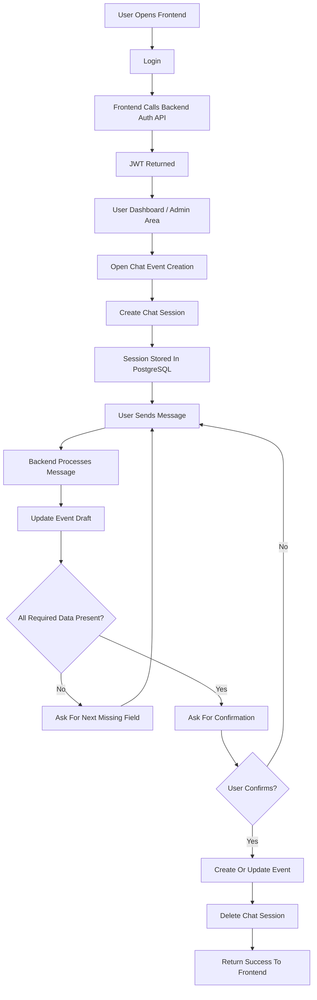
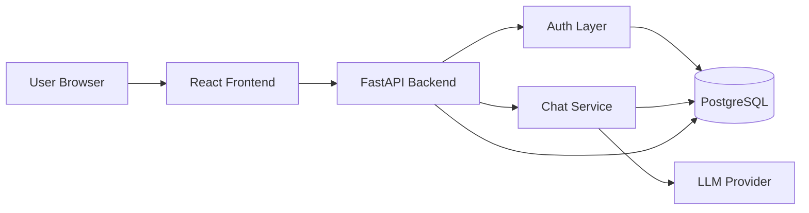
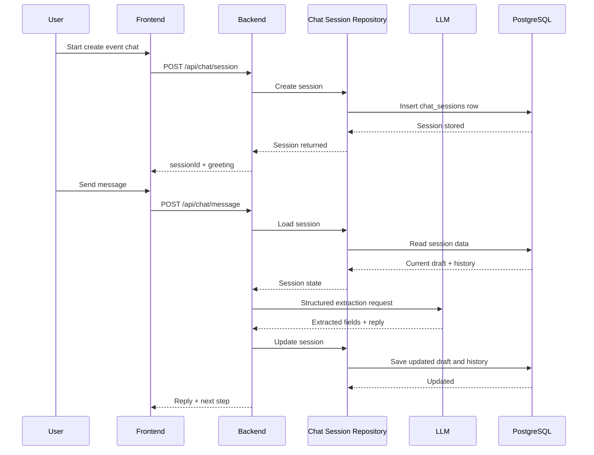

# User Flow And System Design

## Overview

This document explains how users move through the system and how the frontend, backend, AI layer, and database work together. It is intended to give both product and technical readers a single place to understand the overall application behavior.

The platform is a conversational event management system with two main parts:

- a React frontend used by admins and users
- a FastAPI backend that handles authentication, event management, chat orchestration, and persistence

The system is designed so a user can log in, manage events, and create or update event data through a guided chat experience.

## High-Level User Flow

At a high level, the user journey works like this:

1. The user opens the frontend application.
2. The user logs in with valid credentials.
3. The frontend stores the authenticated session token and loads user context.
4. The user can browse events, manage users if they are an admin, or open the conversational assistant.
5. If the user starts the chat flow, the frontend creates a backend chat session.
6. The backend stores the event draft and conversation state in the database.
7. The user sends natural-language messages to describe the event.
8. The backend processes those messages, updates the event draft, and returns the next step or confirmation prompt.
9. Once all required fields are collected, the user confirms event creation or update.
10. The backend writes the final event data to PostgreSQL and removes the temporary chat session.

## User Flow Narrative

A typical user begins by signing into the frontend. After authentication, the user can navigate through the public pages, admin pages, or event management pages depending on permissions. When the user wants to create an event through chat, the frontend sends a request to create a chat session. The backend initializes a session with an empty draft or an existing event draft if the user is editing an event. As the user continues the conversation, each message is sent to the backend, where the assistant extracts structured event details, updates the draft, and stores the evolving session in the database. The backend keeps asking for missing information until the event draft becomes complete. At that point, the system asks the user for explicit confirmation before saving the final event. After the event is created or updated successfully, the chat session is deleted because it is no longer needed as temporary working state.

## User Flow Diagram

## System Design Overview

The system follows a frontend-backend architecture with a shared PostgreSQL database. The frontend is responsible for presentation, user interaction, routing, and API calls. The backend is responsible for business logic, authentication, authorization, chat session orchestration, AI integration, validation, and persistence.

The backend is organized in layered modules:

- `presentation` for routes, middleware, and API schemas
- `application` for business services
- `domain` for chat logic, normalization, validation, and helper rules
- `infrastructure` for repository access to PostgreSQL
- `core` for config, security, logging, and database connection setup

This separation helps keep responsibilities clear and makes the codebase easier to scale and maintain.

## System Component Diagram

## Backend Request Flow

When the frontend sends an API request, the request enters the FastAPI route layer. Middleware handles request tracing, auth context, and security policies. The route passes the request into an application service. The application service performs validation, authorization, and domain logic. If chat functionality is involved, the service may also call the LLM provider for structured extraction. Repositories are then used to read from or write to PostgreSQL. The backend returns a structured JSON response to the frontend, which updates the UI.

## Chat Session Design

The chat feature uses a stateful session design. Each chat session stores:

- conversation history
- event draft
- current step
- mode such as create or update
- language
- session expiry

This allows the user to continue a multi-step event creation flow across refreshes and multiple requests. The session is temporary and is stored in the `chat_sessions` table with a 24-hour sliding expiry.

## Chat Processing Flow Diagram

## Authentication And Authorization Design

Authentication is JWT-based. The frontend sends authenticated requests to the backend after login. The backend resolves the current user through auth dependencies and middleware. Access to admin routes and protected resources depends on the user context stored in the token and validated against backend rules.

This design is used because:

- it works well with a separate frontend and backend
- it is simple to integrate with API calls
- it supports protected routes cleanly
- it avoids server-side rendered session coupling

## Data Storage Design

PostgreSQL is the primary source of truth. It stores:

- users
- roles
- events
- event-role mappings
- chat sessions
- idempotency keys
- error logs

The database design supports both standard application data and temporary conversational workflow data. JSONB is used for chat session state because the chat payload is semi-structured and changes across the conversation.

## Scalability Direction

The current design is suitable for a small-to-medium production system and has clear upgrade paths for future scale. The frontend can be deployed separately from the backend. The backend can be scaled horizontally because the session state is stored in PostgreSQL rather than process memory. The chat layer can later introduce Redis for fast session access, background workers for expiry cleanup and analytics, and separate message tables if chat history volume grows. Because the backend already uses service and repository layers, storage changes can be introduced with limited impact on the route layer.

## Benefits Of This Design

This design gives the project several benefits:

- clear separation between UI, API, business logic, and persistence
- resumable multi-turn chat sessions
- explicit confirmation before final event creation
- centralized validation and authorization
- easier future scaling because state is not tied to one backend process
- easier maintenance because responsibilities are separated by layer

## Summary

The system is designed around a React frontend, a FastAPI backend, an LLM-assisted chat service, and PostgreSQL persistence. From the user perspective, the flow is simple: log in, start a chat, provide event details, confirm the draft, and save the event. From the system perspective, the design is layered, stateful where needed, and flexible enough to scale in the future.
